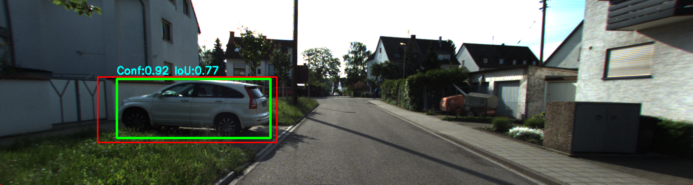

# 🚗 KITTI-360 3D Object Detector Evaluation

This project evaluates a 3D object detector by fusing YOLOv8 instance segmentation with KITTI-360 LiDAR pointclouds. It projects depth into camera space, filters points using segmentation masks, and compares detections against ground truth 3D bounding boxes. The pipeline includes per-car precision/recall analysis, global metrics, and mAP computation across multiple IoU thresholds.

---

## 📌 Project Overview

- 🧠 YOLOv8 instance segmentation on KITTI-360 camera images
- 📡 LiDAR point cloud projection using calibration matrices
- 🎯 Mask-based filtering of 3D points per car
- 📦 Ground truth 3D bounding box matching
- 📊 Evaluation using precision, recall, F1-score, and mAP
- 🎨 Rainbow depth maps and car-only projections
- 📁 Excel reports and AP plots for reproducibility

---

## 🛠️ Technologies Used

| Library        | Purpose                                                                |
|----------------|------------------------------------------------------------------------|
| `ultralytics`  | YOLOv8 segmentation and detection                                      |
| `opencv-python`| Image processing and annotation                                        |
| `numpy`        | Matrix operations and transformations                                  |
| `open3d`       | 3D visualization of point clouds and bounding boxes                    |
| `pandas`       | Excel report generation                                                |
| `matplotlib`   | AP plot visualization                                                  |
| `scikit-learn` | Precision-recall curve and mAP computation                             |

---

## 📁 Folder Structure
KITTI360_3DObjectEvaluation/ 
├── main.py                      # Full 3D fusion and evaluation pipeline   
├── projection.py     # Rainbow depth + car-only projection images   
├── file_graphs.py         # mAP and IoU evaluation with AP plot   
├── requirements.txt             # Python dependencies   
├── README.md                    # Project documentation    
├── LICENSE                      # MIT license   
├── data/   
│   ├── data_2d_raw/                  # KITTI-360 camera images (image_00)   
│   ├── data_3d_raw/                   # Velodyne pointclouds (.bin)   
│   ├── calibration/             # Lidar-to-camera transformation matrix   
│   ├── bboxes_3D_cam0/          # Ground truth 3D bounding boxes (JSON)   
── output/    
── Projection_images/       # Rainbow + car-only depth projections   
── Output/                  # mAP evaluation images   
── car_detections/          # Annotated images + Excel stats   
── car_stats.xlsx           # Evaluation metrics      
── AP_plot.png              # Final AP graph   

---

## 🚀 How to Run  
    
1. Install dependencies  
- pip install -r requirements.txt  
  
2. Prepare your data  
Place the following in the data/ folder:  
- KITTI-360 camera images (image_00)    
- Velodyne pointclouds (velodyne_points)    
- Calibration matrix (calibration)      
- Ground truth 3D bounding boxes (bboxes_3D_cam0)    

3. Run the modules      
Full pipeline with segmentation, projection, and evaluation:  
- python main.py  

Rainbow depth map and car-only projection:    
- python projection_visualizer.py  

mAP and IoU evaluation with AP plot:    
- python detection_metrics.py  

📊 Sample Output    
📍 Annotated Image  
-    
📍 Rainbow Depth Projection  
  
📍 Evaluation Metrics  
- ![Per-car precision, recall, F1-score  
- Global image-level metrics] (car_stats.xlsx)  
-   
📍 AP Plot  
  

📚 References  
- 📘 [KITTI-360 Dataset](https://www.cvlibs.net/datasets/kitti-360/)  
- 📘 [Ultralytics YOLOv8](https://docs.ultralytics.com/)  
- 📘 RWU Lidar and Radar Systems Project Guidelines  

👨‍🎓 Author
Atharva U. Dahitule  
Master’s Student, Mechatronics Engineering  
RWU Hochschule Ravensburg-Weingarten, Germany
